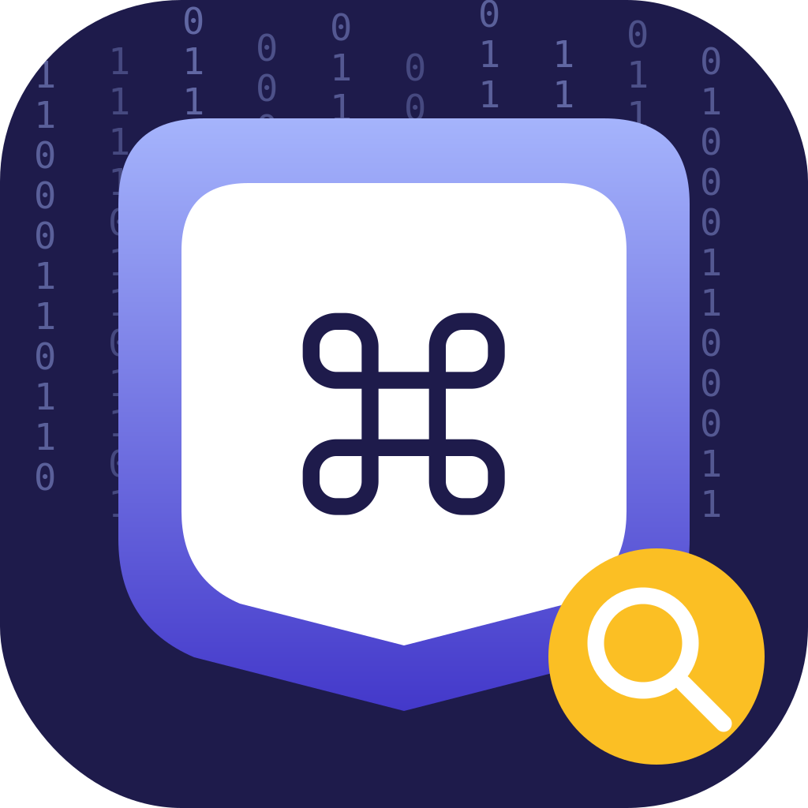

<div align="center">



# privacycommand

**drop an app. see everything it touches.**

Forensic permission audits for any macOS app — built for security teams, IT, and privacy-conscious users.

[](https://github.com/privacykey/privacycommand/releases/latest)
[](https://github.com/privacykey/privacycommand/releases)
[](https://github.com/privacykey/homebrew-tap)
[](https://www.apple.com/macos)
[](LICENSE)

[Download](https://github.com/privacykey/privacycommand/releases/latest) · [Documentation](docs/) · [Release notes](https://github.com/privacykey/privacycommand/releases) · [Report an issue](https://github.com/privacykey/privacycommand/issues)

</div>

---

## What it does

Drop a `.app` bundle (or a `.dmg`) onto privacycommand and it produces a full forensic report of what the app actually touches:

- **Static analysis** — entitlements, code-signing, notarization deep-dive (stapler / spctl / SHA-256), URL schemes, document types, hard-coded domains and URLs, embedded launch agents and helpers, third-party SDK fingerprints (LaunchDarkly, Firebase, Mixpanel, AdMob, …), feature flags and trial-state strings, secrets and license-key names, anti-analysis signals, dylib hijacking surface, and Apple's Privacy Manifest cross-checked against what the binary actually uses.
- **App Store privacy labels** — when the bundle was installed from the Mac App Store, privacycommand fetches the developer's declared Privacy Nutrition Labels from `apps.apple.com` and shows them next to its static-analysis findings, so you can see whether the developer's claims line up with what the binary contains.
- **Telemetry callout** — a Dashboard card flags how many analytics, advertising, and attribution SDKs the bundle ships, with a heat-graded count and per-category breakdown.
- **Background Task Management** — every login item, launch agent, daemon, and helper the app has registered, fetched via the privileged helper so there's no admin prompt.
- **Feature flags & trials** — the names of `isPro`, `isTrial`, `subscription_status`, `experiment_id`, and platform-specific switches (LaunchDarkly, Optimizely, Firebase Remote Config, PostHog, Statsig, Unleash) that the binary checks at runtime.
- **Monitored runs** — launch the inspected app under privacycommand and watch its file events (via an optional privileged helper running `fs_usage`), network destinations, child processes, pasteboard / camera / microphone / screen-recording activity, USB device interactions, and resource usage in real time.
- **Network kill switch** — block the inspected app's outbound traffic system-wide via a `pf` anchor installed by the helper. Watch how the app handles being cut off.
- **VM mode** — a guest agent that runs inside a macOS VM (VirtualBuddy / UTM / Parallels) and ships observations back to the host across the VM boundary, for analysing apps you'd rather not run on your bare-metal machine.
- **Reports** — every finding exports as JSON, HTML, or PDF.

## Install

### Homebrew (recommended)

```sh
brew install privacykey/tap/privacycommand
```

That's it. The tap lives at [`privacykey/homebrew-tap`](https://github.com/privacykey/homebrew-tap); `brew upgrade --cask privacycommand` keeps it current. When privacycommand detects it's running from a Homebrew Caskroom, it disables in-app updates so `brew` stays in charge of the on-disk version.

### Direct download

Grab the signed + notarized `.dmg` from the [latest release](https://github.com/privacykey/privacycommand/releases/latest) and drag the app to `/Applications`. In-app updates are handled by [Sparkle 2](https://sparkle-project.org); they're **off by default** — you opt in via Settings → Updates.

### Build from source

```sh
git clone https://github.com/privacykey/privacycommand.git
cd privacycommand/privacycommand
open privacycommand.xcodeproj
```

Then in Xcode:
1. **File → Add Package Dependencies…** → `https://github.com/sparkle-project/Sparkle` (Up to Next Major from `2.9.0`). Tick the `Sparkle` product on the `privacycommand` target.
2. Select the **privacycommandHelper** target → Signing & Capabilities → set Team to match the app.
3. ⌘B.

The Swift Package Manager target builds with `swift build` from `privacycommand/`; tests run with `swift test`.

## Screenshots

> _Screenshots go here once the brand site is up. The Dashboard renders telemetry, App Store privacy labels, live probes, and a forensic findings list; the Static tab walks every signal we extract from the binary._


## How it works

privacycommand is a SwiftUI app backed by a pure-Swift analyzer library and an optional privileged helper. The architecture is split deliberately:

| Layer | Path | Notes |
|---|---|---|
| Analyzer logic | [`privacycommand/Sources/privacycommandCore/`](privacycommand/Sources/privacycommandCore/) | Headless, AppKit-free; runs from CLI, tests, GUI |
| App UI | [`privacycommand/Sources/privacycommand/`](privacycommand/Sources/privacycommand/) | SwiftUI views + view-models |
| Privileged helper | [`privacycommand/Sources/privacycommandHelper/`](privacycommand/Sources/privacycommandHelper/) | XPC service installed via `SMAppService.daemon` |
| Guest agent (VM) | [`privacycommand/Sources/privacycommandGuestAgent/`](privacycommand/Sources/privacycommandGuestAgent/) | Runs in-VM, ships observations to the host |

Read [`architecture.md`](ARCHITECTURE.md) for the longer version.

## Updates

Updates ship through two channels that share the same DMG:

1. **Direct downloads** receive in-app updates via Sparkle 2. Auto-checks are off by default — opt in via Settings → Updates.
2. **Homebrew** users update via `brew upgrade --cask privacycommand`. privacycommand detects Cask installs and disables Sparkle's installer to stay out of `brew`'s way.

The appcast feed is hosted on `gh-pages` at `https://privacykey.github.io/privacycommand/appcast.xml` and signed with EdDSA — see [`docs/RELEASES.md`](docs/RELEASES.md) for the release flow.

## Privacy & telemetry posture

privacycommand is a privacy tool and behaves like one:

- **No analytics.** privacycommand does not ship any analytics SDKs. There is no telemetry endpoint, no install counter, no crash-report bucket.
- **Network calls are explicit and bounded.**
  - DNS reverse lookups for destinations the inspected app contacts (so the Network tab can label `8.8.8.8` as `dns.google`).
  - Mac App Store privacy-label lookups against `itunes.apple.com` and `apps.apple.com` — keyed by the inspected app's bundle ID, never your data.
  - Sparkle appcast fetch from `privacykey.github.io` when you check for updates.
- **All analysis runs locally.** The inspected app's contents never leave your machine.
- **The helper is opt-in.** Without the helper, privacycommand still works — file-event monitoring is unavailable and the Background Task Management audit asks before triggering an admin prompt.

## Contributing

Issues and PRs welcome. Before opening a PR:

- Run `swift test` from `privacycommand/` and confirm it passes.
- For UI changes, attach a before/after screenshot.
- For new analysis signals, add a Knowledge Base entry alongside the detector — privacycommand explains what every finding means in plain English, and we want to keep that contract.

## Security disclosures

If you find a security issue, please **don't** open a public issue. Email `security@privacykey.org` with the details. We aim to respond within 72 hours.

## Related products

privacycommand is a **privacykey** project

- **[privacycommand](https://github.com/privacykey/privacycommand)** — macOS forensic permission auditor _(this repo)_

## License

Released under the [MIT License](LICENSE).
