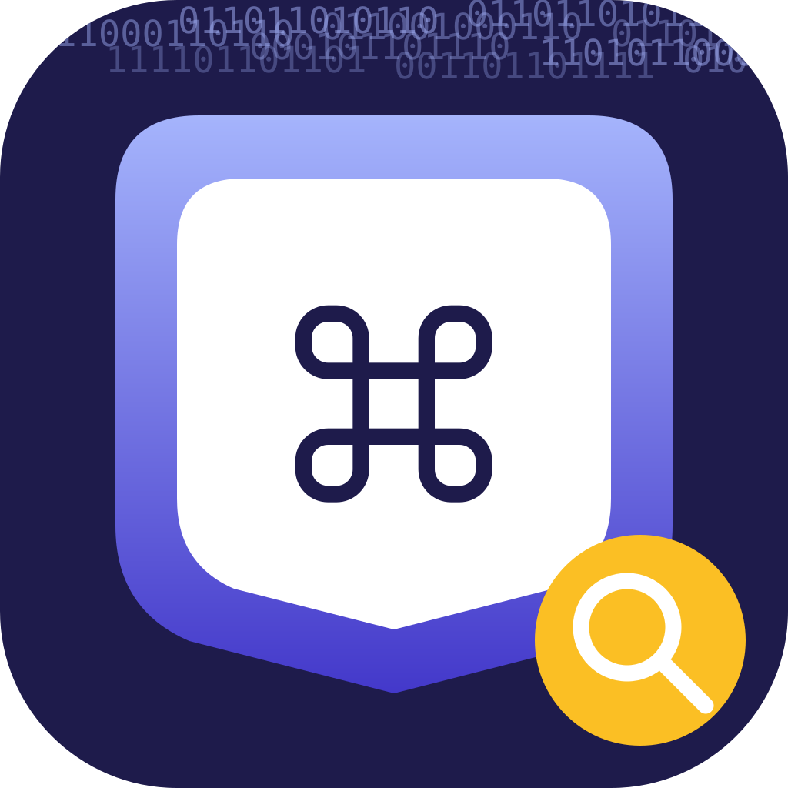

<div align="center">



# privacycommand

**drop an app. see everything it touches.**

Forensic permission audits for any macOS app.

[](https://github.com/privacykey/.github/blob/main/STATUS.md#privacycommand)
[](https://github.com/privacykey/privacycommand/releases/latest)
[](LICENSE)
[](https://github.com/privacykey/privacycommand/actions/workflows/app-ci.yml)

</div>

<!-- disclosure:start -->
> [!WARNING]
> **Pre-1.0 — no stable release yet.** Anything can change in any release, including a patch: APIs, CLI flags, config keys, file formats, and data already on disk. Keep your own backups.
> **Project status.** The badge above is generated from [the privacykey status list](https://github.com/privacykey/.github/blob/main/STATUS.md), which says what I promise for this project and every other one.
<!-- disclosure:end -->

---

privacycommand takes a `.app` bundle (or a `.dmg`) and reports what the app actually touches: the entitlements it claims, the permissions it will ask for, the domains and URLs compiled into its binary, the third-party SDKs it ships, the login items and helpers it registers — and, if you let it, what it does while it runs.

It is built for people who want evidence rather than a vendor's word: security teams, IT, and anyone deciding whether a download deserves a place in `/Applications`. Every finding carries a plain-English explanation from an in-app knowledge base, so a report is readable without a reverse-engineering background.

All analysis happens on your machine, and the app ships no analytics of its own. The exact list of network calls it makes is in [`docs/PRIVACY.md`](docs/PRIVACY.md).


## What it does

- **Static analysis** — entitlements, code signing (the 10-character Team ID expanded to the developer's name), a notarization deep-dive (stapler / spctl / SHA-256), URL schemes, document types, hard-coded domains, embedded launch agents and helpers, feature-flag and trial-state strings, secrets and licence-key names, anti-analysis signals, dylib hijacking surface, and Apple's Privacy Manifest checked against what the binary actually uses.
- **SDK fingerprints** — which analytics, advertising and attribution SDKs the bundle ships, with a heat-graded count and per-category breakdown.
- **Outbound call sites** — which functions can open a connection, the networking symbols they reach for (BSD sockets, `getaddrinfo`, CFNetwork, `nw_*`), and any host or URL literals sitting next to them. Any call site can be decompiled on demand if you have Ghidra installed.
- **App Store privacy labels** — for Mac App Store bundles, the developer's declared Privacy Nutrition Labels sit next to the static findings, so you can see whether the claims match the binary.
- **Background Task Management** — every login item, launch agent, daemon and helper the app has registered, read through the privileged helper.
- **Monitored runs** — launch the inspected app under privacycommand and watch, in real time, its file events (via the optional helper running `fs_usage`), network destinations with reverse-DNS labels, child processes, pasteboard / camera / microphone / screen-recording activity, USB device interactions and resource usage.
- **Network kill switch** — cut the app off from the destinations it is contacting, via a `pf` anchor installed by the helper, and watch how it copes.
- **VM mode** — a guest agent that runs inside a macOS VM (VirtualBuddy / UTM / Parallels) and ships observations back to the host, for apps you would rather not run on bare metal.
- **Compare runs** — diff any two saved reports from the History tab. Added and removed entitlements, domains, SDKs, login items and findings are colour-cued, with a "show only changes" toggle.
- **Batch scan** — point it at a folder, or at all of `/Applications`, and triage many apps at once in a sortable table of risk tiers, warning counts and headline signals.
- **Reports** — every finding exports as JSON, HTML or PDF.

## Get it

Requires macOS 13 or later.

**Homebrew** — the cask lives in [`privacykey/homebrew-tap`](https://github.com/privacykey/homebrew-tap):

```sh
brew install --cask privacykey/tap/privacycommand
```

`brew upgrade --cask privacycommand` keeps it current. When privacycommand detects it is running from a Homebrew Caskroom it disables in-app updates, so `brew` stays in charge of the on-disk version.

**Direct download** — take the signed and notarized `.dmg` from the [latest release](https://github.com/privacykey/privacycommand/releases/latest) and drag the app to `/Applications`. In-app updates use [Sparkle 2](https://sparkle-project.org) against an EdDSA-signed [appcast feed](https://privacykey.github.io/privacycommand/appcast.xml); automatic checks are **off by default** and you opt in under Settings → Updates.

**Command line** — the repo also builds `auditctl`, a CLI over the same analyser. Its `preview` command inspects Homebrew casks *before* you update them; it never runs `brew`, never blocks an update, and always exits 0. Building and using it is covered in [CONTRIBUTING.md](CONTRIBUTING.md#the-auditctl-cli).

## Docs

There is no docs site yet. What exists lives in the repo:

- [`.github/ARCHITECTURE.md`](.github/ARCHITECTURE.md) — the targets, why they are separate, how data moves between them.
- [`privacycommand/README.md`](privacycommand/README.md) — source-tree map, signing and entitlements reference, troubleshooting.
- [`privacycommand/HELPER.md`](privacycommand/HELPER.md) — privileged helper bundling, signing and verification.
- [`privacycommand/docs/GUEST_AGENT.md`](privacycommand/docs/GUEST_AGENT.md) — VM guest-agent walkthroughs.
- [`docs/PRIVACY.md`](docs/PRIVACY.md) — every network call the app makes, and why.
- [`NOTICES.md`](NOTICES.md) — third-party notices.

## Contributing

Issues and pull requests are welcome. CI runs two workflows on every pull request: the SPM build and test suite plus an `auditctl` smoke test, and an unsigned Xcode build of the app target. Reproduce the first locally from `privacycommand/`:

```sh
swift build
swift test
```

Or `just build` and `just test` from the repo root. Setup, the Xcode path, and what to include in a pull request are in [CONTRIBUTING.md](CONTRIBUTING.md).

Found a security issue? Please do not open a public issue — [`.github/SECURITY.md`](.github/SECURITY.md) has the reporting address and what is in scope.

## Licence

Released under the [MIT licence](LICENSE).
